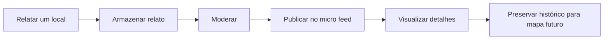

# TODO — MVP portfoliável do Caminho Limpo

## Objetivo do primeiro ciclo

Entregar uma aplicação pequena, completa e demonstrável em que uma pessoa possa relatar um lugar que precisa de cuidado e, depois da moderação, esse relato apareça em um micro feed público.

O primeiro ciclo deve provar este fluxo:

## Definição de pronto do MVP

- [ ] Uma pessoa consegue enviar um relato pelo celular.
- [ ] O relato armazena localização, categoria, descrição e foto.
- [ ] O sistema gera um protocolo após o envio.
- [ ] O relato não é publicado automaticamente.
- [ ] Uma pessoa moderadora consegue aprovar ou rejeitar o relato.
- [ ] Relatos aprovados aparecem em um feed público paginado.
- [ ] Cada relato publicado possui uma página de detalhes.
- [ ] Dados pessoais não aparecem publicamente.
- [ ] O projeto possui dados de demonstração e uma apresentação clara no portfólio.

---

## Marco 0 — Fechar o recorte do produto

### Linguagem e posicionamento

- [ ] Usar **“Relatar um local”** como CTA principal.
- [ ] Usar **“lugares que precisam de cuidado”** na comunicação pública.
- [ ] Evitar “lugares feios” na interface e no banco de dados.
- [ ] Escrever uma descrição curta do projeto para a landing page.
- [ ] Escrever o aviso de que o Caminho Limpo não é um serviço de emergência.
- [ ] Escrever o aviso de que o envio não garante atendimento ou remoção.

### Escopo explícito

- [ ] Confirmar que o MVP terá formulário, moderação, feed e página individual.
- [ ] Manter mapa público fora do primeiro ciclo.
- [ ] Manter comentários, curtidas, seguidores e chat fora do primeiro ciclo.
- [ ] Manter cadastro obrigatório de usuários fora do primeiro ciclo.
- [ ] Permitir relato anônimo ou com e-mail confidencial opcional.

**Entrega:** uma proposta de produto que cabe em uma demonstração curta e funciona de ponta a ponta.

---

## Marco 1 — Fundação técnica

### Ambiente

- [ ] Confirmar banco de dados usado em desenvolvimento e produção.
- [ ] Configurar armazenamento de imagens em disco local no desenvolvimento.
- [ ] Definir armazenamento compatível com produção.
- [ ] Configurar limite de tamanho e formatos permitidos para imagens.
- [ ] Definir variáveis de ambiente necessárias sem armazenar segredos no repositório.

### Qualidade básica

- [ ] Criar uma convenção para estados, categorias e protocolos.
- [ ] Adicionar testes para o fluxo principal desde a primeira funcionalidade.
- [ ] Configurar tratamento de erros para uploads e persistência.
- [ ] Garantir que logs não exponham dados pessoais ou conteúdo sensível.

**Entrega:** aplicação preparada para persistir relatos e imagens com segurança básica.

---

## Marco 2 — Modelagem de dados

### Entidades do MVP

- [ ] Criar entidade `Place` para representar o local físico.
- [ ] Criar entidade `Report` para representar cada relato enviado.
- [ ] Criar entidade `ReportImage` para evidências visuais.
- [ ] Criar entidade ou histórico para decisões de moderação.
- [ ] Relacionar vários relatos a um mesmo local.

### Campos mínimos de `Place`

- [ ] Identificador interno.
- [ ] Latitude e longitude.
- [ ] Endereço aproximado.
- [ ] Bairro, cidade e estado quando disponíveis.
- [ ] Status consolidado do local.
- [ ] Datas de criação e atualização.

### Campos mínimos de `Report`

- [ ] Identificador interno.
- [ ] Protocolo público não previsível.
- [ ] Referência ao local.
- [ ] Categoria.
- [ ] Descrição original.
- [ ] Data da observação.
- [ ] Nível de risco informado.
- [ ] Frequência percebida.
- [ ] Estado de moderação.
- [ ] Nome opcional e privado.
- [ ] E-mail opcional e privado.
- [ ] Consentimentos registrados separadamente.
- [ ] Datas de envio, moderação e publicação.

### Valores iniciais

- [ ] Definir categorias de problemas.
- [ ] Definir estados do relato: recebido, em triagem, publicado, restrito e rejeitado.
- [ ] Definir estados do local: relatado, confirmado, recorrente, encaminhado, em atendimento, resolvido e monitorado.
- [ ] Criar factories e seeders com dados fictícios de demonstração.

### Preparação para o futuro

- [ ] Armazenar coordenadas desde o primeiro relato, mesmo sem mapa público.
- [ ] Não sobrescrever silenciosamente descrição ou evidências originais.
- [ ] Preparar o vínculo de novos relatos com locais existentes.
- [ ] Manter decisões e alterações de status em histórico.

**Entrega:** banco capaz de sustentar o micro feed agora e o mapa posteriormente.

---

## Marco 3 — Formulário “Relatar um local”

### Interface

- [ ] Adicionar CTA “Relatar um local” na navegação e na landing page.
- [ ] Criar página pública responsiva para o formulário.
- [ ] Dividir o formulário em etapas curtas ou seções bem demarcadas.
- [ ] Exibir progresso e erros próximos aos respectivos campos.
- [ ] Preservar os dados preenchidos quando houver erro de validação.

### Campos

- [ ] Categoria do problema.
- [ ] Descrição curta com limite de 500 caracteres.
- [ ] Data da observação preenchida inicialmente com a data atual.
- [ ] Endereço ou referência do local.
- [ ] Latitude e longitude.
- [ ] Uma a cinco fotos.
- [ ] Frequência: pontual, recorrente ou permanente.
- [ ] Indicação de risco imediato.
- [ ] Nome opcional.
- [ ] E-mail opcional.
- [ ] Confirmação de veracidade segundo o conhecimento da pessoa.
- [ ] Confirmação de autorização para enviar as imagens.
- [ ] Consentimento separado para comunicações futuras.

### Localização

- [ ] Permitir usar a localização atual do dispositivo.
- [ ] Permitir preencher ou corrigir o endereço manualmente.
- [ ] Tratar recusa de permissão de localização sem bloquear o formulário.
- [ ] Validar se as coordenadas recebidas são plausíveis.
- [ ] Adiar geocodificação reversa caso ela aumente demais o escopo inicial.

### Fotos

- [ ] Validar formato, quantidade e tamanho no servidor.
- [ ] Gerar nome de arquivo não previsível.
- [ ] Armazenar arquivos fora de caminhos executáveis.
- [ ] Remover metadados sensíveis antes da publicação.
- [ ] Preparar versão otimizada para o feed.
- [ ] Não publicar automaticamente a imagem original.

### Envio e protocolo

- [ ] Validar todos os dados no servidor.
- [ ] Criar ou vincular o local do relato.
- [ ] Salvar o relato inicialmente como `recebido`.
- [ ] Gerar protocolo público.
- [ ] Exibir página de confirmação com resumo e protocolo.
- [ ] Enviar confirmação por e-mail apenas quando o e-mail for informado.
- [ ] Informar os canais oficiais para situações urgentes.

### Testes

- [ ] Testar envio mínimo válido.
- [ ] Testar envio anônimo.
- [ ] Testar envio com contato confidencial.
- [ ] Testar validações obrigatórias.
- [ ] Testar upload inválido e excedente.
- [ ] Testar falha de persistência sem deixar arquivos órfãos.
- [ ] Testar geração e unicidade do protocolo.

**Entrega:** qualquer visitante consegue registrar um local e recebe um protocolo, sem publicação automática.

---

## Marco 4 — Moderação interna

### Acesso

- [ ] Implementar autenticação apenas para pessoas moderadoras.
- [ ] Criar autorização por papel ou permissão.
- [ ] Impedir acesso público às telas e ações administrativas.
- [ ] Criar uma conta moderadora de demonstração sem credenciais reais no repositório.

### Fila de triagem

- [ ] Listar relatos recebidos e em triagem.
- [ ] Filtrar por status, categoria, risco, data e cidade.
- [ ] Exibir localização, descrição, imagens e dados privados em áreas separadas.
- [ ] Alertar sobre conteúdo potencialmente sensível.
- [ ] Permitir assumir ou iniciar a triagem de um relato.

### Decisões

- [ ] Aprovar e publicar relato.
- [ ] Rejeitar com motivo obrigatório.
- [ ] Marcar como restrito sem publicação pública.
- [ ] Corrigir somente campos públicos derivados, preservando o original.
- [ ] Vincular o relato a um local já existente.
- [ ] Criar um novo local quando não houver correspondência.
- [ ] Registrar pessoa moderadora, data e motivo de cada decisão.

### Testes

- [ ] Testar autorização das rotas administrativas.
- [ ] Testar aprovação e publicação.
- [ ] Testar rejeição com motivo.
- [ ] Testar restrição de um relato.
- [ ] Testar vínculo com local existente.
- [ ] Garantir que contatos privados nunca sejam serializados na resposta pública.

**Entrega:** nenhum conteúdo chega ao feed sem uma decisão explícita de moderação.

---

## Marco 5 — Micro feed público

### Listagem

- [ ] Criar rota e página pública do feed.
- [ ] Mostrar apenas relatos publicados.
- [ ] Ordenar por publicação mais recente.
- [ ] Adicionar paginação.
- [ ] Exibir foto tratada, categoria, cidade ou bairro, data e trecho da descrição.
- [ ] Exibir estado do local com linguagem clara.
- [ ] Criar estado vazio útil quando não houver relatos.
- [ ] Criar fallback visual quando não houver foto pública.

### Filtros iniciais

- [ ] Filtrar por categoria.
- [ ] Filtrar por cidade.
- [ ] Filtrar por status do local.
- [ ] Preservar filtros durante a paginação.
- [ ] Manter busca textual e ordenações avançadas fora do MVP se atrasarem a entrega.

### Privacidade

- [ ] Não mostrar nome ou e-mail da pessoa que enviou.
- [ ] Não exibir coordenadas exatas no feed.
- [ ] Exibir somente endereço aproximado aprovado na moderação.
- [ ] Usar imagens tratadas para publicação.
- [ ] Identificar conteúdo como “relatado pela comunidade” quando ainda não estiver confirmado.

### Testes

- [ ] Garantir que relatos recebidos, restritos e rejeitados não aparecem.
- [ ] Testar paginação e filtros.
- [ ] Testar ausência de dados pessoais no HTML e nas respostas.
- [ ] Testar layout com descrições e nomes de locais longos.

**Entrega:** um feed pequeno, confiável e navegável que demonstra a proposta de rede territorial.

---

## Marco 6 — Página individual do relato

- [ ] Criar URL pública estável para cada relato publicado.
- [ ] Exibir fotos, categoria, descrição, data e localização aproximada.
- [ ] Exibir claramente o status do local.
- [ ] Explicar a diferença entre “relatado” e “confirmado”.
- [ ] Mostrar outros relatos públicos vinculados ao mesmo local.
- [ ] Preparar uma linha do tempo simples do local.
- [ ] Adicionar metadados de compartilhamento.
- [ ] Adicionar botão para relatar nova observação no mesmo local em fase posterior.
- [ ] Garantir que relatos despublicados deixem de ser acessíveis publicamente.

**Entrega:** cada item do feed tem contexto suficiente para ser entendido e compartilhado.

---

## Marco 7 — Integração com a landing page

- [ ] Atualizar o CTA principal para “Relatar um local”.
- [ ] Adicionar link “Explorar relatos” na navegação.
- [ ] Explicar em três passos: relatar, verificar e acompanhar.
- [ ] Mostrar uma prévia dos relatos mais recentes na landing page.
- [ ] Separar “Quero ser voluntário” do fluxo de relato.
- [ ] Deixar WhatsApp apenas como canal de orientação, se for mantido.
- [ ] Revisar todo texto para não prometer resolução garantida.
- [ ] Garantir scroll suave, foco visível e navegação móvel acessível.

**Entrega:** a landing apresenta o produto real, não apenas uma causa abstrata.

---

## Marco 8 — Segurança, privacidade e operação

- [ ] Criar termos específicos para envio de relatos.
- [ ] Criar política de privacidade compatível com o MVP.
- [ ] Definir prazo de retenção dos dados pessoais opcionais.
- [ ] Definir procedimento de correção e remoção de dados.
- [ ] Aplicar rate limiting no envio do formulário.
- [ ] Adicionar proteção contra spam.
- [ ] Validar MIME real dos arquivos enviados.
- [ ] Bloquear conteúdo executável e extensões perigosas.
- [ ] Fazer backup do banco e das evidências.
- [ ] Definir rotina mínima de triagem.
- [ ] Criar orientações para rostos, placas, residências e acusações.
- [ ] Registrar erros sem expor relatos ou contatos.

**Entrega:** o projeto pode ser demonstrado publicamente sem tratar privacidade e moderação como detalhes posteriores.

---

## Marco 9 — Acessibilidade e experiência móvel

- [ ] Testar todo o fluxo apenas com teclado.
- [ ] Garantir rótulos e mensagens de erro associados aos campos.
- [ ] Garantir contraste suficiente em textos, botões e estados.
- [ ] Oferecer alternativas textuais adequadas para imagens.
- [ ] Não depender apenas de cor para comunicar status.
- [ ] Testar o formulário em telas móveis estreitas.
- [ ] Testar upload usando câmera e galeria do celular.
- [ ] Respeitar preferência de movimento reduzido.
- [ ] Verificar que conteúdos longos não causam sobreposição.
- [ ] Testar conexão lenta e falha durante upload.

**Entrega:** o principal fluxo funciona de forma confortável em um celular real.

---

## Marco 10 — Preparação do portfólio

### Narrativa

- [ ] Documentar a experiência pessoal que motivou o projeto.
- [ ] Explicar o problema observado sem estigmatizar bairros ou moradores.
- [ ] Apresentar a hipótese: preservar histórico territorial para permitir ação futura.
- [ ] Mostrar por que o MVP começa com dados estruturados e moderação.
- [ ] Explicar decisões de privacidade e segurança.
- [ ] Registrar o que ficou deliberadamente fora do escopo.

### Demonstração

- [ ] Criar dados fictícios coerentes e identificados como demonstração.
- [ ] Preparar um roteiro de três minutos.
- [ ] Demonstrar envio, protocolo, moderação e publicação no feed.
- [ ] Capturar telas desktop e mobile.
- [ ] Criar diagrama simples da arquitetura.
- [ ] Documentar modelo de dados e principais decisões técnicas.
- [ ] Publicar aplicação em ambiente acessível.
- [ ] Adicionar monitoramento básico de disponibilidade e erros.

### README do projeto

- [ ] Substituir o README padrão do Laravel.
- [ ] Adicionar visão, motivação e escopo.
- [ ] Adicionar instruções de instalação.
- [ ] Adicionar comandos de teste e build.
- [ ] Adicionar screenshots.
- [ ] Adicionar roadmap.
- [ ] Informar que os dados demonstrativos são fictícios.

**Entrega:** projeto compreensível para recrutadores e desenvolvedores sem explicação oral adicional.

---

## Depois do MVP

### Confirmação e histórico

- [ ] Permitir “Também observei este problema”.
- [ ] Permitir nova evidência vinculada ao mesmo local.
- [ ] Exibir antes e depois.
- [ ] Detectar recorrência após resolução.
- [ ] Notificar quem forneceu e-mail sobre mudanças relevantes.

### Mapa

- [ ] Escolher biblioteca e provedor cartográfico.
- [ ] Exibir apenas locais moderados.
- [ ] Agrupar pontos próximos.
- [ ] Aplicar filtros do feed ao mapa.
- [ ] Proteger localizações sensíveis.
- [ ] Permitir alternar entre mapa e feed.

### Comunidade

- [ ] Seguir cidade, bairro ou local.
- [ ] Criar atualizações territoriais.
- [ ] Organizar ações e mutirões.
- [ ] Reconhecer contribuições sem criar competição nociva.
- [ ] Avaliar perfis públicos somente após validar uma necessidade real.

### Inteligência e parcerias

- [ ] Criar indicadores de recorrência e concentração.
- [ ] Medir tempo entre relato, encaminhamento e resolução.
- [ ] Exportar relatórios sem dados pessoais.
- [ ] Estruturar encaminhamento para órgãos públicos e parceiros.
- [ ] Documentar metodologia antes de publicar rankings territoriais.

---

## Ordem de implementação recomendada

1. [ ] Modelagem mínima e factories.
2. [ ] Formulário sem upload, salvando um relato recebido.
3. [ ] Teste automatizado do envio e protocolo.
4. [ ] Upload seguro de fotos.
5. [ ] Autenticação e fila de moderação.
6. [ ] Aprovação de um relato.
7. [ ] Feed mostrando somente relatos aprovados.
8. [ ] Página individual.
9. [ ] Filtros básicos.
10. [ ] Integração completa com a landing.
11. [ ] Privacidade, acessibilidade e hardening.
12. [ ] Dados de demonstração, README e deploy.

## Regra para controlar o escopo

Uma funcionalidade só entra no MVP se for necessária para completar este percurso:

> **relatar → armazenar → moderar → publicar → consultar**

Tudo que não fortalece diretamente esse percurso deve permanecer em **Depois do MVP**.
