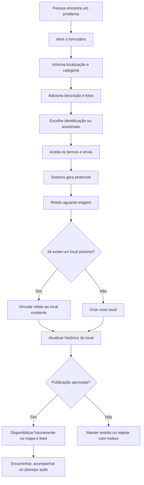

# Ecossistema de relatos do Caminho Limpo

## Visão

O Caminho Limpo deve ser uma rede colaborativa para registrar, visualizar e acompanhar lugares que precisam de cuidado.

O primeiro passo não é construir uma rede social completa, mas criar uma base confiável de relatos georreferenciados. Esses dados poderão alimentar, no futuro:

- um mapa público de problemas;
- um feed de relatos e atualizações;
- ações comunitárias e mutirões;
- encaminhamentos para órgãos responsáveis;
- análises sobre recorrência e concentração de problemas;
- parcerias com prefeituras, cooperativas e organizações locais;
- acompanhamento do antes e depois de cada local.

> Na comunicação pública, é preferível usar termos como **lugares que precisam de cuidado**, **pontos de descarte** ou **problemas urbanos e ambientais**. "Lugares feios" pode ser útil internamente para explicar a ideia, mas é subjetivo e pode estigmatizar bairros e comunidades.

## Princípio do produto

O ativo central do ecossistema não é a denúncia isolada. É o histórico verificável de um local.

Um mesmo ponto pode receber diferentes relatos ao longo do tempo. Por isso, o sistema deve separar:

- **Local:** posição geográfica onde existe um problema;
- **Relato:** registro enviado por uma pessoa sobre esse local;
- **Evidência:** fotos e informações anexadas ao relato;
- **Atualização:** mudança observada depois do relato inicial;
- **Ação:** encaminhamento, limpeza, mutirão ou outra intervenção;
- **Status:** situação atual consolidada do local.

Essa separação evita criar vários pontos duplicados no mapa e permite construir uma linha do tempo real.

## Evolução proposta

### Fase 1: coleta estruturada

Criar um formulário público curto para registrar relatos e armazená-los com localização, categoria, descrição e evidências.

Objetivos:

- começar a formar a base geográfica;
- entender quais problemas são mais frequentes;
- validar a disposição das pessoas em colaborar;
- definir uma rotina de moderação e triagem;
- aprender quais dados são realmente úteis.

### Fase 2: mapa e acompanhamento

Disponibilizar os pontos aprovados em um mapa, permitindo filtros por categoria, data, status e região.

Funcionalidades esperadas:

- visualizar relatos próximos;
- identificar possíveis duplicidades;
- acompanhar a situação de um local;
- adicionar uma atualização ou nova evidência;
- indicar que o problema ainda existe;
- mostrar resultados de ações realizadas.

### Fase 3: feed e comunidade

Transformar atualizações dos locais em um feed territorial, sem depender inicialmente de perfis sociais complexos.

Possibilidades:

- seguir um bairro, cidade ou ponto;
- receber atualizações relevantes;
- confirmar relatos existentes;
- participar de ações comunitárias;
- publicar registros de antes e depois;
- reconhecer colaboradores sem expor dados pessoais sensíveis.

### Fase 4: inteligência e mobilização

Usar a base histórica para priorizar ações e formar parcerias.

Possibilidades:

- mapa de recorrência;
- indicadores por bairro ou categoria;
- identificação de pontos críticos;
- planejamento de mutirões;
- encaminhamento estruturado para órgãos públicos;
- relatórios de impacto e tempo de resolução.

## Fluxo do MVP

## Formulário inicial

O formulário deve ser curto no primeiro contato. Campos complementares podem aparecer conforme a categoria escolhida.

### Campos obrigatórios

1. **Localização**
   - posição marcada no mapa ou localização atual;
   - endereço aproximado preenchido automaticamente quando possível;
   - possibilidade de corrigir manualmente o ponto.

2. **Categoria do problema**
   - lixo doméstico;
   - entulho de obra;
   - móvel ou objeto volumoso;
   - resíduo reciclável;
   - resíduo perigoso ou químico;
   - esgoto ou água contaminada;
   - terreno ou área abandonada;
   - outro.

3. **Descrição curta**
   - o que existe no local;
   - referência para encontrá-lo;
   - limite sugerido de 500 caracteres.

4. **Data da observação**
   - preenchida inicialmente com a data atual;
   - editável caso a pessoa esteja registrando algo anterior.

5. **Declaração de responsabilidade**
   - confirmação de que as informações são verdadeiras segundo o conhecimento da pessoa;
   - confirmação de que ela tem autorização para enviar as imagens.

### Campos recomendados

- uma a cinco fotos;
- dimensão aproximada do problema;
- indicação de risco imediato;
- frequência percebida: pontual, recorrente ou permanente;
- nome opcional;
- e-mail opcional para protocolo e atualizações;
- autorização separada para receber comunicações.

### Identificação e privacidade

O envio deve permitir três situações claras:

- **Anônimo:** nenhum dado de contato é fornecido;
- **Identificado e confidencial:** os dados são usados internamente, mas não aparecem publicamente;
- **Identificado publicamente:** opção futura e sempre voluntária.

No MVP, a recomendação é oferecer apenas as duas primeiras opções. O nome de quem relata não é necessário para o mapa funcionar.

## Confirmação após o envio

Após concluir o formulário, a pessoa deve receber:

- número de protocolo;
- resumo do relato;
- explicação de que o registro passará por triagem;
- aviso de que o Caminho Limpo não garante a remoção ou resolução;
- link futuro para consultar o andamento, quando houver esse recurso;
- orientação para autoridades em casos de risco imediato.

Exemplo de mensagem:

> Relato recebido. O protocolo é **CL-2026-000123**. Vamos verificar as informações e relacioná-las ao local correspondente. Este registro ajuda a formar o mapa colaborativo do Caminho Limpo, mas não substitui serviços públicos de emergência ou canais oficiais.

## Estados do relato

- **Recebido:** armazenado com sucesso;
- **Em triagem:** aguardando verificação e classificação;
- **Publicado:** aprovado para aparecer futuramente no mapa e no feed;
- **Vinculado:** associado a um local já existente;
- **Restrito:** válido, mas não pode ser exibido publicamente;
- **Rejeitado:** spam, duplicidade sem informação adicional ou conteúdo inválido.

## Estados do local

- **Relatado:** existe ao menos um relato aprovado;
- **Confirmado:** possui confirmação ou evidências suficientes;
- **Recorrente:** voltou a apresentar o problema depois de uma intervenção;
- **Encaminhado:** enviado a um órgão ou parceiro;
- **Ação planejada:** existe uma intervenção programada;
- **Em atendimento:** uma ação está em andamento;
- **Resolvido:** evidências indicam que o problema foi removido;
- **Monitorado:** resolvido, mas acompanhado por risco de recorrência;
- **Arquivado:** local mantido apenas no histórico.

## Dados mínimos a preservar

Para permitir o crescimento do ecossistema, cada registro deve manter:

- identificador único;
- protocolo público não sequencial ou não previsível;
- latitude e longitude;
- endereço aproximado e componentes geográficos disponíveis;
- categoria e subcategoria;
- descrição original;
- data da observação e data do envio;
- fotos originais e versões tratadas para publicação;
- nível de risco informado;
- status e histórico de alterações;
- origem do relato;
- vínculo com um local existente, quando houver;
- dados de contato criptografados ou protegidos, quando fornecidos;
- consentimentos registrados separadamente;
- decisões de moderação e seus motivos.

Não se deve sobrescrever silenciosamente o relato original. Correções, moderações e mudanças de status precisam formar um histórico.

## Moderação e qualidade

Antes de publicar um relato, a triagem deve verificar:

- se a localização é plausível;
- se as imagens correspondem ao problema descrito;
- se existem rostos, placas ou informações pessoais visíveis;
- se há acusações contra pessoas ou empresas;
- se o conteúdo pode expor residências ou grupos vulneráveis;
- se já existe um local próximo com o mesmo problema;
- se a categoria e o nível de risco estão corretos.

O sistema não deve apresentar relatos não verificados como fatos definitivos. No mapa, a linguagem pode distinguir **relatado pela comunidade** de **confirmado**.

## Duplicidade e recorrência

Dois relatos próximos não são necessariamente duplicados. Podem representar:

- o mesmo problema visto por pessoas diferentes;
- uma nova evidência do mesmo local;
- o retorno de um problema já resolvido;
- problemas distintos na mesma área.

A triagem deve considerar distância, categoria, período e imagens antes de vincular os relatos. Mesmo quando vinculado, o novo relato deve ser preservado, pois confirma relevância ou recorrência.

## Canais

### Canal principal

**Formulário no site**, pois produz dados estruturados e georreferenciados.

CTA recomendado:

> Relatar um local

Esse texto é mais amplo e menos punitivo do que "denunciar", além de combinar melhor com a proposta de mapa colaborativo.

### Canais complementares

- `relatos@caminholimpo.org` para casos detalhados ou problemas no formulário;
- links para canais oficiais da prefeitura, serviço 156 e órgãos ambientais;
- WhatsApp Business apenas para orientação e dúvidas, não como base oficial dos relatos.

Todo relato recebido por outro canal deverá ser registrado no mesmo sistema para evitar bases paralelas.

## Segurança e LGPD

- coletar apenas dados necessários;
- separar contato, consentimento e conteúdo público;
- definir prazos de retenção para dados pessoais;
- preservar o histórico ambiental sem reter indefinidamente informações pessoais;
- remover metadados sensíveis das fotos antes da publicação;
- ocultar rostos, placas e números de imóveis quando necessário;
- não publicar a localização exata quando isso criar risco;
- disponibilizar meios para correção, remoção e exercício dos direitos do titular;
- restringir o painel de triagem por perfil e registrar acessos relevantes;
- manter política de privacidade e termos específicos para o envio de relatos.

## Casos urgentes

O Caminho Limpo não deve assumir o papel de serviço de emergência. O formulário deve orientar a pessoa a procurar diretamente as autoridades quando houver:

- incêndio;
- produto químico ou material hospitalar;
- risco de explosão;
- animal ou pessoa em perigo;
- crime em andamento;
- bloqueio viário com risco imediato;
- contaminação grave de água.

O relato pode ser armazenado posteriormente para fins históricos, mas a interface precisa deixar claro que o envio ao Caminho Limpo não aciona atendimento emergencial.

## Métricas iniciais

- relatos enviados por semana;
- percentual concluído no formulário;
- percentual aprovado na triagem;
- tempo médio de triagem;
- relatos vinculados a locais existentes;
- locais com relatos recorrentes;
- distribuição por categoria e região;
- quantidade de relatos anônimos e identificados;
- pontos encaminhados, atendidos e resolvidos;
- quantidade de atualizações de antes e depois.

## Escopo recomendado para o primeiro lançamento

Construir somente:

1. formulário público responsivo;
2. captura de localização por mapa ou GPS;
3. upload de fotos;
4. protocolo após o envio;
5. armazenamento estruturado;
6. painel interno simples para triagem;
7. proteção de dados e moderação básica.

Deixar para depois:

- perfis públicos;
- comentários;
- curtidas;
- seguidores;
- ranking de usuários;
- mensagens privadas;
- feed algorítmico;
- mapa público sem moderação.

Essa ordem permite validar o valor principal — registrar e compreender os locais — antes de assumir a complexidade e os riscos de uma rede social completa.
